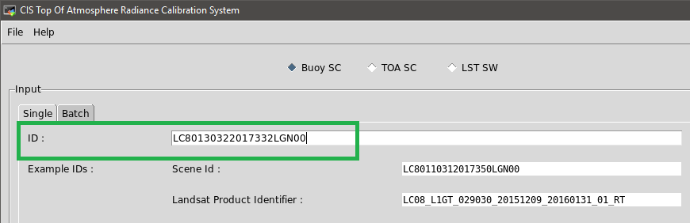
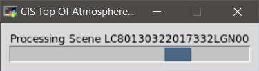
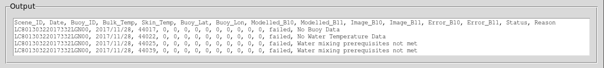

# Landsat Buoy Calibration - User Manual
The program started in its original version is a mere command line tool where a user had to enter the full command line with arguments to perform a Top of Atmosphere calculation.  The current version of the program no longer requires the user to know the command line arguments to perform calculations as it has an application interface.

There is both a graphical user interface as well as a terminal interface to allow users with terminal emulators that do not support X11 forwarding to also use the program.

# Table of Contents
=================

<!--ts-->
* [Table of Contents](#table-of-contents)
* [General Overview](#general-overview)
    * [Get a Copy of the Program](#get-a-copy-of-the-program)
    * [Limitations](#limitations)
* [Graphical User Interface](#graphical-user-interface)
    * [Overview](#gui-overview)
    * [Launching the GUI](#launching-the-gui)
    * [Interface](#gui-interface)
    * [Processing](#gui-processing)
        * [Single Channel using Buoy Data](#gui-single-channel-using-buoy-data)
            * [Buoy Single Scene](#gui-buoy-single-scene)
            * [Buoy Batch Processing](#gui-buoy-batch-processing)
        * [Single Channel Top of Atmosphere](#gui-single-channel-top-of-atmosphere)
        * [Split Window Land Surface Temperature](#gui-split-window-land-surface-temperature)
* [Terminal Interface](#original-version)
    * [Overview](#terminal-overview)
    * [Launching the Terminal Interface](#launching-the-terminal-interface)
    * [Interface](#terminal-interface)
    * [Processing](#terminal-processing)
        * [Single Channel using Buoy Data](#terminal-single-channel-using-buoy-data)
            * [Buoy Single Scene](#terminal-buoy-single-scene)
            * [Buoy Batch Processing](#terminal-buoy-batch-processing)
        * [Single Channel Top of Atmosphere](#terminal-single-channel-top-of-atmosphere)
        * [Split Window Land Surface Temperature](#terminal-split-window-land-surface-temperature)
* [Output](#output)
* [Notes](#notes)
<!--te-->

# General Overview
## Get a Copy of the Program
To download a copy of the program, enter the following command in your home directory on the server

```
https://github.com/bkleynhans/Landsat-Buoy-Calibration.git
```

This will download a copy of the program in a directory named 'Landsat-Buoy-Calibration' in your home directory on the server.

## Limitations
There are some limitations in the GUI implementation, most notibly because Copy and Paste functionality depends on the configuration of the host server (two servers with different operating systems can host the same program and the copy and paste functionality would be different between them).  As such it is important that the user not the different methods of copy and paste available.

1. Method 1
> * Copy  : Ctrl + C
> * Paste : Ctrl + V
2. Method 2
> * Copy  : Select the text with mouse, text will be copied on mouse button release
> * Paste : Ctrl + Shift + Insert

# Graphical User Interface
## GUI Overview
The GUI was built using the native tkinter library included in the Python programming language.  This allows the program to be launched remotely on a linux server and the GUI to be used on the local client machine.

## Launching the GUI
Change into the Landsat-Buoy-Calibration directory
```
cd Landsat-Buoy-Calibration
```
Launch the program
```
./cis-tarca.py
```

## GUI Interface
When launching the program, it starts by testing that all required data sources are available, this process is done for both the terminal and GUI interfaces.  Because the sources are required to download data required to perform the required processing, the program will not launch without them all being present.


Once it has been determined that all required sources are available


The program will launch


## GUI Processing
The program itself consists of multiple sections as indicated with green numbers in the following image.


1. Menu Bar
> * File menu has Exit option which closes the program
> * Help menu opens this help page in a browser (from the linux host).  This is not recommended as the linux host-based browser can be slow.
2. Process Selection Option Boxes
> * Here you can select between the following options for processing
>> * Buoy SC - Use NOAA buoy data along with a landsat scene to model Top of Atmosphere Radiance using the Single Channel algorithm.
>> * TOA SC - Use User supplied data along with a landsat scene to model Top of Atmosphere Radiance using the Single Channel algorithm.
>> * LST SW - Use user supplied data along with a landsat scene to model Land Surface Temperature using the Split Window algorithm.
3. Input Frame
> * The input frame is the only frame where user input is read from.
4. Single/Batch
> * Here users can choose to process a single landsat scene, or a batch of scenes.
5. Example IDs
> * The system currently accepts landsat scenes in the two supplied formats.  The scenes will be tested for validity when the Process button is pressed.
6. Process Button
> * Starts the actual calculation process.
7. Output Frame
> * After processing, the results will be displayed here.
8. Status Frame
> * This frame gets continually updated with the current process to indicate to the user what stage of the analysis the user is on.

### GUI Single Channel using Buoy Data
The original version of this module (no gui, just command line processing) was developed on Fedora x64 by Nathan Dileas (nid4986@g.rit.edu).  His original work is available at the links provided below.  

Repository: https://github.com/natedileas/Landsat-Buoy-Calibration.  
README: https://github.com/natedileas/Landsat-Buoy-Calibration/blob/master/README.md

The current version includes some corrections pertaining to bulk temperature, where additional parameters were including in the water mixing prerequisites to determine validity of raw data before performing calculations.  This mitigates instances where scenes were included or excluded with invalid bulk temperature condition restrictions.

#### GUI Buoy Single Scene
To process a single scene, copy a scene ID or Product Identifier and paste it into the ID field.



Click the 'Process' button to the right immediately below the Input frame to begin processing.


If you provide an invalid scene ID/product ID, the system will display an error message indicating that there is an error with the ID.


During processing, the 'Process' button is disabled.  A progress bar will be displayed on the screen, indicating the scene id that was specified,



and the 'Status' frame at the bottom of the page will provide the user with feedback as the process continues.


Once processing has completed, the progress bar will disappear, the 'Process' button will be enabled, and the output will be displayed in the Output frame.



To get details about the output files, please refer to the output section in this document.

#### GUI Buoy Batch Processing
To process a batch of scenes you first have to copy the batch file into the appropriate directory.  Batches are automatically detected from the input/batches directory when clicking the 'Browse' button on the batch processing screen.  You can then select the required batch file from the structure.

Batch files must be in the format of 1 scene id/product id per line, with no punctuation (no spaces, no breaks, no commas, no titles, etc.)  An example of a batch file is included in the Landsat-Buoy-Calibration/Examples/input/batches/ directory.  The examples include 1 working batch, one empty batch and one faulty batch.  Faulty scene ID/product ID's will be detected when the 'Process' button is pressed.

To upload your own batch, create the file using your favorite text editor (Notepad++ in Windows and Notepadqq in Linux are good options).  Connect to the server with a SFTP/SCP client, copy and paste the file in the input/batches directory.


Click on the 'Browse' button next to the text field, which will open a file browser.


Browse to your batch file, click the file and click on 'Open'.


This will take you back to the main window and the path to your batch file will now be displayed in the 'Source File' field.


Click on the Process button to process the selected batch file.


If any of the IDs in the provided batch file is of an invalid format (please note, this does not for EXISTING IDs, only that the IDs conform to the landsat naming conventions ), a warning will be displayed indicating both the invalid ID as well as the line in the batch file where it is located.


During processing, the 'Process' button is disabled.  A progress bar will be displayed on the screen, indicating the batch file name that was specified.


The 'Status' frame at the bottom of the page will provide the user with feedback as the process continues.  The 'Output' frame is also continuously updated as each scene is finished processing.


Once processing has completed, the progress bar will disappear, the 'Process' button will be enabled, and the output will be displayed in the Output frame.

To get details about the output files, please refer to the output section in this document.

### GUI Single Channel Top of Atmosphere
Modelling Top of Atmosphere using the Single Channel method without using buoy data is a little more involved.  For the Buoy process all the data is acquired either from the buoy data file, or from the landsat file.  Since we are not using buoys for data, the user has to provide the required information themselves.  A landsat scene with scene ID/product ID is still required for the area in question.


Click the 'Process' button to the right immediately below the Input frame to begin processing.


If any of the supplied values are invalid, you will receive an error message indicating what errors need to be corrected


If all the data entered are within the valid ranges, the data will be processed.  During processing, the 'Process' button is disabled.  A progress bar will be displayed on the screen, indicating the scene ID that was specified,


and the 'Status' frame at the bottom of the page will provide the user with feedback as the process continues.


Since the calculation is done only for a single set of lat/lon coordinates, the output will reflect only the data for a single point.


To get details about the output files, please refer to the output section in this document.

### GUI Split Window Land Surface Temperature
Modelling Land Surface Temperature using the Split Window method is a little more involved.  For the Buoy process all the data is acquired either from the buoy data file, or from the landsat file.  Since we are not using buoys for data, the user has to provide the required information themselves.  A landsat scene with scene ID/product ID is still required for the area in question.


The Split Window process allows the user to add Gain and Bias for bands 10 and 11.  The default gain and bias is always populated, but they are not added to the calculation while the 'Add Gain and Bias to Calculation' checkbox is unchecked.


If the 'Add Gain and Bias to Calculation' checkbox is checked, they will be added to the calculation.  These default values in the textboxes can be changed by simply removing and overwriting them.


Click the 'Process' button to the right immediately below the Input frame to begin processing.


If any of the supplied values are invalid, you will receive an error message indicating what errors need to be corrected


If all the data entered are within the valid ranges, the data will be processed.  During processing, the 'Process' button is disabled.  A progress bar will be displayed on the screen, 


and the 'Status' frame at the bottom of the page will provide the user with feedback as the process continues.


Since the calculation is done only for a single set of lat/lon coordinates, the output will reflect only the data for a single point.


To get details about the output files, please refer to the output section in this document.

# Terminal Interface
## Terminal Overview
The console based interface is a basic text interface with menu options and user input sections.  Data validation is done during user input and since the program is text based it should run in any terminal emulator.

## Launching the Terminal Interface

Change into the Landsat-Buoy-Calibration directory
```
cd Landsat-Buoy-Calibration
```
Launch the program
```
./cis-tarca.py -i terminal
```

## Terminal Interface
When launching the program, it starts by testing that all required data sources are available, this process is done for both the terminal and GUI interfaces.  Because the sources are required to download data required to perform the required processing, the program will not launch without them all being present.


Once it has been determined that all required sources are available


the program will launch


## Terminal Processing
### Terminal Single Channel using Buoy Data
#### Terminal Buoy Single Scene
#### Terminal Buoy Batch Processing
### Terminal Single Channel Top of Atmosphere
### Terminal Split Window Land Surface Temperature
# Output

# Notes