# Landsat Buoy Calibration - User Manual
The program started in its original version is a mere command line tool where a user had to enter the full command line with arguments to perform a Top of Atmosphere calculation.  The current version of the program no longer requires the user to know the command line arguments to perform calculations as it has an application interface.

There is both a graphical user interface as well as a terminal interface to allow users with terminal emulators that do not support X11 forwarding to also use the program.

# Table of Contents
=================

<!--ts-->
* [Table of Contents](#table-of-contents)
* [General Overview](#general-overview)
    * [Installation](#installation)
    * [Limitations](#limitations)
* [Graphical User Interface](#graphical-user-interface)
    * [Overview](#gui-overview)
    * [Launching the GUI](#launching-the-gui)
    * [Interface](#gui-interface)
    * [Processing](#gui-processing)
        * [Single Channel using Buoy Data](#gui-single-channel-using-buoy-data)
            * [Buoy Single Scene](#gui-buoy-single-scene)
            * [Buoy Batch Processing](#gui-buoy-batch-processing)
        * [Single Channel Top of Atmosphere](#gui-single-channel-top-of-atmosphere)
        * [Split Window Land Surface Temperature](#gui-split-window-land-surface-temperature)
* [Text-Based Interface](#text-based-interface)
    * [Overview](#terminal-overview)
    * [Launching the Terminal Interface](#launching-the-terminal-interface)
    * [Interface](#terminal-interface)
    * [Processing](#terminal-processing)
        * [Single Channel using Buoy Data](#terminal-single-channel-using-buoy-data)
            * [Buoy Single Scene](#terminal-buoy-single-scene)
            * [Buoy Batch Processing](#terminal-buoy-batch-processing)
        * [Single Channel Top of Atmosphere](#terminal-single-channel-top-of-atmosphere)
        * [Split Window Land Surface Temperature](#terminal-split-window-land-surface-temperature)
* [Output](#output)
* [Notes](#notes)
<!--te-->

# General Overview
## Installation
It is highly recommended that the software is run on one of the RIT CIS linux servers. There are a number of prerequisites required, some of which are challenging to install and others (like <a href="http://modtran.spectral.com/modtran_order">MODTRAN</a>) are quite expensive for individual use.


To download a copy of the program, enter the following command while in your home directory in a SSH session on the server.

```
git pull https://github.com/bkleynhans/Landsat-Buoy-Calibration.git
```

This will download a copy of the program in a directory named <strong>Landsat-Buoy-Calibration</strong> in your home directory on the server.

## Limitations
There are some limitations in the GUI implementation, most notibly because Copy and Paste functionality depends on the configuration of the host server (two servers with different operating systems can host the same program and the copy and paste functionality would be different between them).  As such it is important that the user knows some of the different methods of copy and paste that are available.  Common examples are: 

<ol>
    <li>Method 1</li>
    <ul style="list-style-type:none;">
        <li>Copy  : Ctrl + C</li>
        <li>Paste : Ctrl + V</li>
    </ul>
    <li>Method 2</li>
    <ul style="list-style-type:none;">
        <li>Copy  : Select the text with mouse, text will be copied on mouse button release</li>
        <li>Paste : Ctrl + Shift + Insert</li>
    </ul>
</ol>

If none of these combinations work on your server, it is recommended that you contact your system administrator to determine what the combinations are for your specific server.

# Graphical User Interface
## GUI Overview
The GUI was built using the native tkinter library included in the Python programming language which maximizes compatibility, and allows the program to be launched remotely on a linux server while the GUI is used on the local client machine.

In order for the GUI to function, your server needs to be configured to export its X11 display, and the SSH client program needs to support X11 exported displays. Because some users may not know whether these services are available, the program will check if X11 display export is available during program launch.  If the service is not available, the program will inform the user and then launch the terminal version of the program.  For help on the terminal program, please refer to the [Text-Based Interface](#text-based-interface) documentation.

<p>
    <strong><font color='red'>PLEASE NOTE:  </font></strong>
    The GUI opens in a 1024x768 resolution.  If your display is set to a lower resolution or you have desktop scaling enabled, the window may be too large for your display!
</p>

## Launching the GUI
Change into the <strong>Landsat-Buoy-Calibration</strong> directory
```
<your chosen path>/Landsat-Buoy-Calibration
```
Launch the program
```
./cis-tarca.py
```

## GUI Interface
When launching the program, it starts by testing that all required data sources are available, this process is done for both the terminal and GUI interfaces.  Because the sources are required to download data that is used to perform the processing, the program will not launch without them all being present.

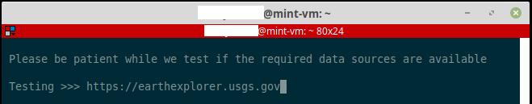<br>

<br>

Once the program has been determined that all its required sources are available it will launch.

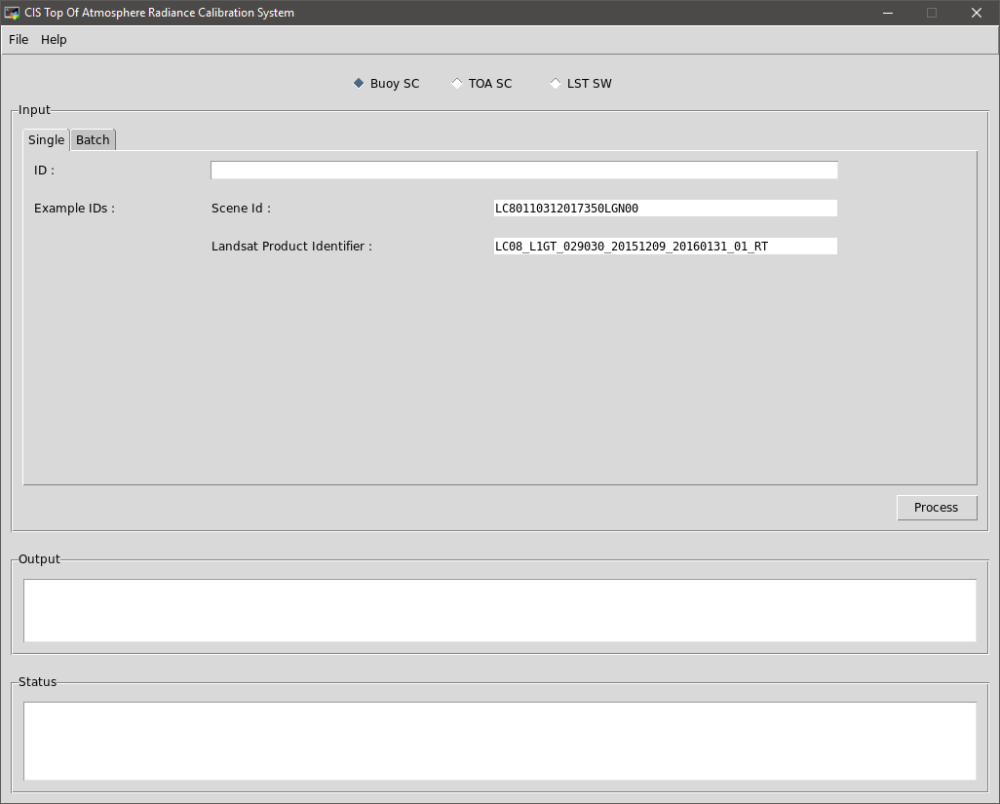<br>

## GUI Processing
The program itself consists of multiple sections as indicated with green numbers in the following image.

<br>

<ol>
    <li>Menu Bar<ul style="list-style-type:none;">
        <li>File menu has an Exit option which closes the program</li>
        <li>Help menu opens this help page in a browser (from the linux host).  <em>This is not recommended as the linux host-based browser can be slow. It is suggested that you open the help file directly from github.</em></li>
    </ul></li>
    <li>Process Selection Option Boxes<ul style="list-style-type:none;">
        <li>Here you can select between the following options for processing<ul>
            <li>Buoy SC - Use NOAA buoy data along with a landsat scene to model Top of Atmosphere Radiance using the Single Channel algorithm.</li>
            <li>TOA SC - Use User supplied data along with a landsat scene to model Top of Atmosphere Radiance using the Single Channel algorithm.</li>
            <li>LST SW - Use user supplied data along with a landsat scene to model Land Surface Temperature using the Split Window algorithm.</li>
        </ul></li>
    </ul></li>
    <li>Input Frame<ul style="list-style-type:none;">
            <li>The input frame is the only frame where user input is read from.</li>
    </ul></li>
    <li>Single / Batch<ul style="list-style-type:none;">
        <li>Here users can choose to process a single landsat scene, or a batch of scenes.</li>
    </ul></li>
    <li>Example IDs<ul style="list-style-type:none;">
        <li>The system currently accepts landsat scenes in the two supplied formats.  The scenes will be tested for validity when the Process button is pressed.</li>
    </ul></li>
    <li>Process Button<ul style="list-style-type:none;">
        <li>Starts the actual calculation process.</li>
    </ul></li>
    <li>Output Frame<ul style="list-style-type:none;">
        <li>After processing, the results will be displayed here.</li>
    </ul></li>
    <li>Status Frame<ul style="list-style-type:none;">
        <li>This frame gets continually updated with the current process to indicate to the user what stage of the analysis the user is on.</li>
    </ul></li>
</ol>

### GUI Single Channel using Buoy Data
The original version of this module (no gui, just command line processing) was developed on Fedora x64 by Nathan Dileas (nid4986@g.rit.edu).  His original work is available at the links provided below.  

Repository: https://github.com/natedileas/Landsat-Buoy-Calibration.  
README: https://github.com/natedileas/Landsat-Buoy-Calibration/blob/master/README.md

The current version includes some corrections pertaining to bulk temperature, where additional parameters were including in the water mixing prerequisites to determine validity of raw data before processing.  This mitigates instances where scenes were included or excluded with invalid bulk temperature condition restrictions.

The algorithms used by Nathan in his original version, as well as the algorithms used in the current version are based on work done by Frank Pedula in his thesis: 

<a href="https://www.cis.rit.edu/~cnspci/references/theses/masters/padula2008.pdf">Historic Thermal Calibration of Landsat 5 TM through an Improved Physics Based Approach</a>

#### GUI Buoy Single Scene
To process a single scene, copy a Scene ID or Product ID and paste it into the <strong>ID</strong> field.

<br>

Click the <strong>Process</strong> button to the right, immediately below the Input frame to begin processing.

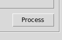<br>

If you provided an invalid Scene ID/Product ID, the system will display an error message indicating that there is an error with the <strong>ID</strong>.

<br>

During processing, the <strong>Process</strong> button is disabled.  A progress bar will be displayed on the screen, indicating the Scene ID that was specified.

<br>

The <strong>Status</strong> frame at the bottom of the page will provide the user with feedback as the process continues.

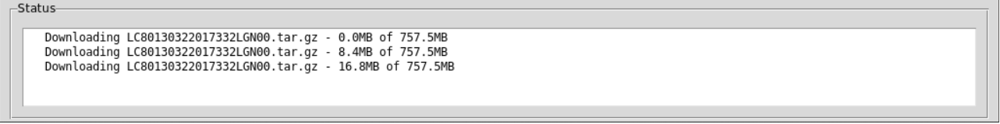<br>

Once processing has completed, the progress bar will disappear, the <strong>Process</strong> button will be enabled, and the output will be displayed in the Output frame.

<br>

To get details about the output files, please refer to the [Output](#output) section at the bottom of this document.

#### GUI Buoy Batch Processing
> To process a batch of scenes you first have to copy the batch file into the appropriate directory.  
> 
> ```
> <your chosen path>/Landsat-Buoy-Calibration/input/batches
> ```
> 
> The file can have any extension, however the extention <strong>.batch</strong> is suggested to keep it separate from other extensions that are used in the program.
>
> Batches are automatically detected from the <em>input/batches</em> directory when clicking the <strong>Browse</strong> button on the batch processing screen.  From the Browse window you can select the required batch file from within the file structure.
> 
> Batch files must be in the format of <strong>1 Scene ID/Product ID per line</strong> (the different formats of Scene IDs and Product IDs may be mixed in the same batch file), with <strong>NO</strong> punctuation (no spaces, no breaks, no commas, no titles, etc.).  The example included below is the <em>small.batch</em> file:
> 
> ```
> LC80130322017332LGN00 
> LC08_L1TP_017030_20160614_20170220_01_T1
> LC80140372017307LGN00
> ```
> 
> There are three examples included in the <em>Landsat-Buoy-Calibration/Examples/input/batches/</em> directory.  The examples include one working batch, one empty batch and one faulty batch.  Faulty Scene ID/Product ID's will be detected when the <strong>Process</strong> button is pressed.
> 
>> To upload your own batch, create the file using your favorite text editor (<a href="https://notepad-plus-plus.org/">Notepad++</a> in Windows and <a href="https://notepadqq.com">Notepadqq</a> in Linux are good options).  Connect to the server with a SFTP/SCP client, then copy and paste the file in the <em>input/batches</em> directory.

Click on the <strong>Browse</strong> button next to the text field, which will open a file browser.

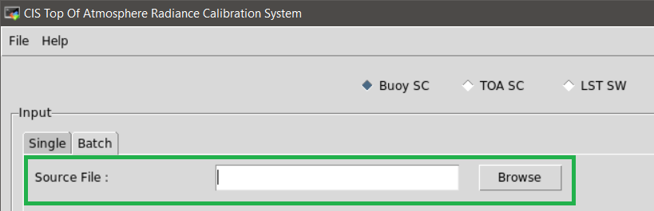<br>

Browse to your batch file, click the file and click on <strong>Open</strong>.

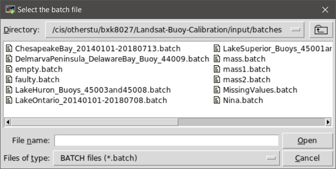<br>

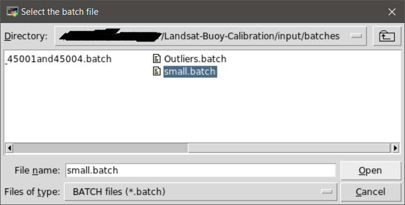<br>

This will take you back to the main window and the path to your batch file will now be displayed in the <strong>Source File</strong> field.

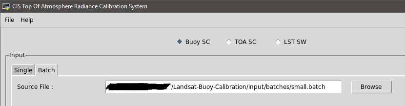<br>

Click on the Process button to process the selected batch file.

<br>

If any of the IDs in the provided batch file is of an invalid format (please note, this does not for EXISTING IDs, only that the IDs conform to the landsat naming conventions ), a warning will be displayed indicating both the invalid ID as well as the line in the batch file where it is located.

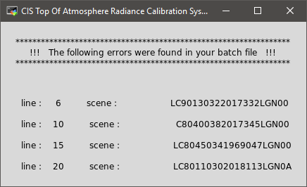<br>

During processing, the <strong>Process</strong> button is disabled.  A progress bar will be displayed on the screen, indicating the batch file name that was specified.

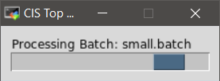<br>

The <strong>Status</strong> frame at the bottom of the page will provide the user with feedback as the process continues.  The <strong>Output</strong> frame is also continuously updated as each scene is finished processing.

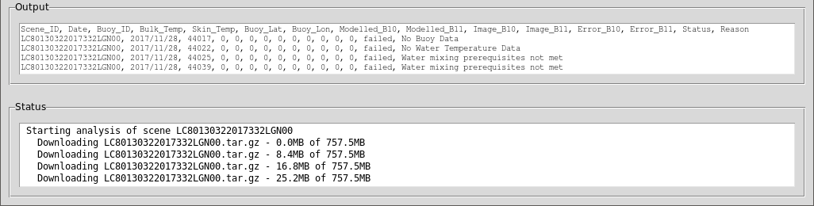<br>

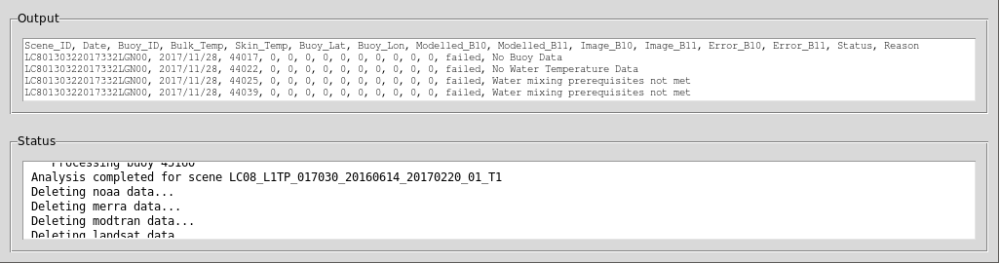<br>

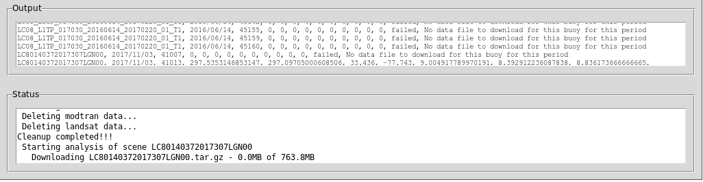<br>

Once processing has completed, the progress bar will disappear, the <strong>Process</strong> button will be enabled, and the output will be displayed in the Output frame.

To get details about the output files, please refer to the [Output](#output) section at the bottom of this document.

### GUI Single Channel Top of Atmosphere
Modelling Top of Atmosphere using the Single Channel method without using buoy data is a little more involved.  For the Buoy process all the data is acquired either from the buoy data file, or from the landsat file.  Since we are not using buoys for data, the user has to provide the required information themselves.  A landsat scene with Scene ID/Product ID is still required for the area in question.

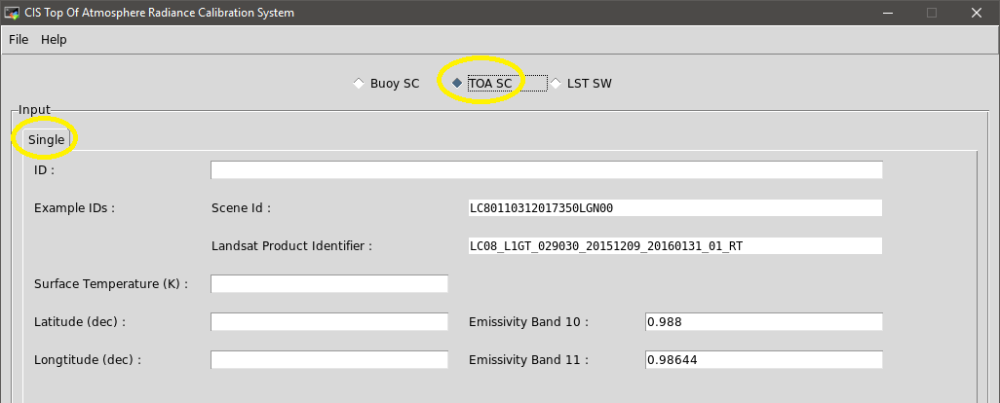<br>

Click the <strong>Process</strong> button to the right immediately below the Input frame to begin processing.

<br>

If any of the supplied values are invalid, you will receive an error message indicating what errors need to be corrected

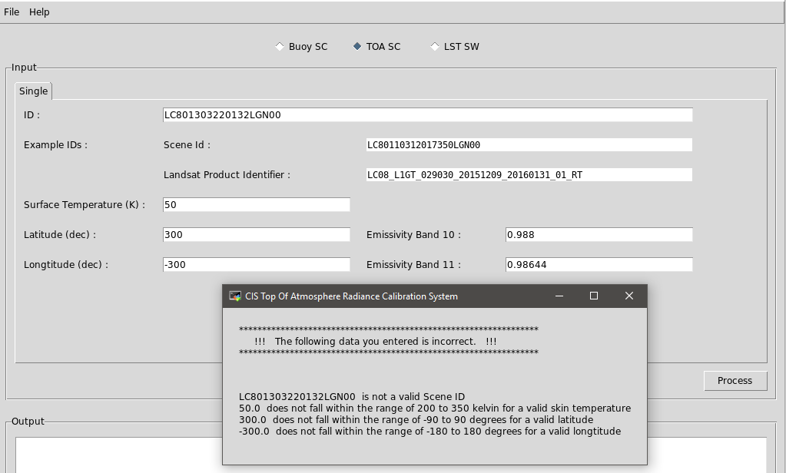<br>

If all the data entered are within the valid ranges, the data will be processed.  During processing, the <strong>Process</strong> button is disabled.  A progress bar will be displayed on the screen, indicating the Scene ID that was specified,

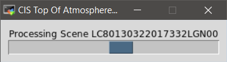<br>

and the <strong>Status</strong> frame at the bottom of the page will provide the user with feedback as the process continues.

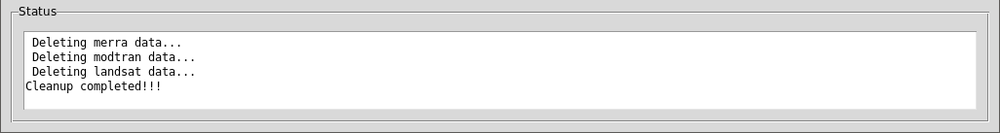<br>

Since the calculation is done only for a single set of lat/lon coordinates, the output will reflect only the data for a single point.

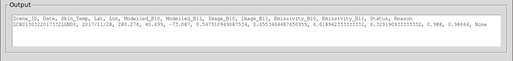<br>

To get details about the output files, please refer to the [Output](#output) section at the bottom of this document.

### GUI Split Window Land Surface Temperature
Modelling Land Surface Temperature using the Split Window method is a little more involved.  For the Buoy process all the data is acquired either from the buoy data file, or from the landsat file.  Since we are not using buoys for data, the user has to provide the required information themselves.  A landsat scene with Scene ID/Product ID is still required for the area in question.

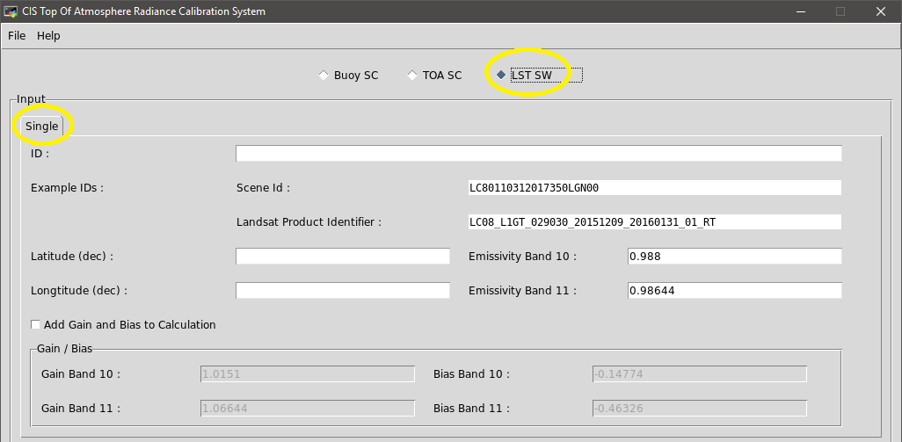<br>

The Split Window process allows the user to add Gain and Bias for bands 10 and 11.  The default gain and bias is always populated, but they are not added to the calculation while the <strong>Add Gain and Bias to Calculation</strong> checkbox is unchecked.

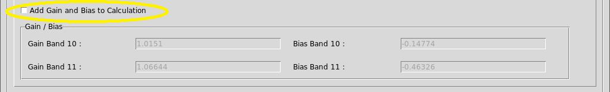<br>

If the <strong>Add Gain and Bias to Calculation</strong> checkbox is checked, they will be added to the calculation.  These default values in the textboxes can be changed by simply removing and overwriting them.

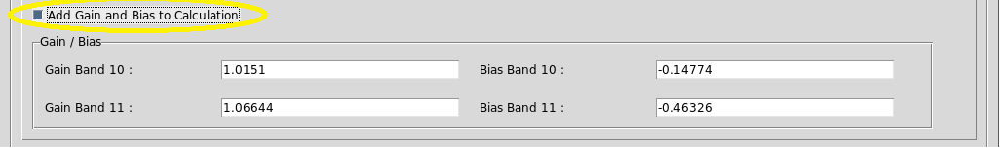<br>

Click the <strong>Process</strong> button to the right immediately below the Input frame to begin processing.

<br>

If any of the supplied values are invalid, you will receive an error message indicating what errors need to be corrected

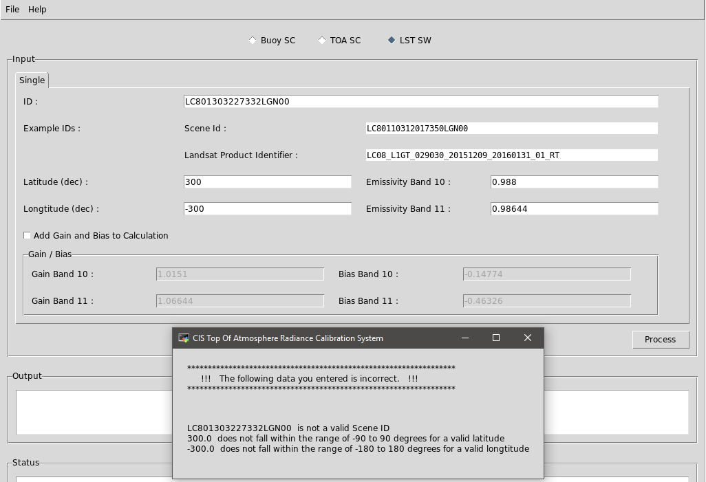<br>

If all the data entered are within the valid ranges, the data will be processed.  During processing, the <strong>Process</strong> button is disabled.  A progress bar will be displayed on the screen, 

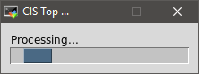<br>

and the <strong>Status</strong> frame at the bottom of the page will provide the user with feedback as the process continues.

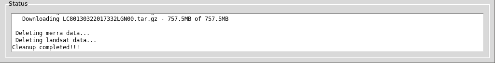<br>

Since the calculation is done only for a single set of lat/lon coordinates, the output will reflect only the data for a single point.

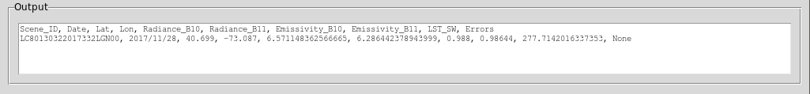<br>

To get details about the output files, please refer to the [Output](#output) section at the bottom of this document.

# Text-Based Interface
## Terminal Overview
The console based interface is a basic text interface with menu options and user input sections.  Data validation is done during user input and since the program is text based it should run in any terminal emulator.

## Launching the Terminal Interface

Change into the <strong>Landsat-Buoy-Calibration</strong> directory
```
<your chosen path>/Landsat-Buoy-Calibration
```
Launch the program
```
./cis-tarca.py -i terminal
```

## Terminal Interface
When launching the program, it starts by testing that all required data sources are available, this process is done for both the terminal and GUI interfaces.  Because the sources are required to download data that is used to perform the required processing, the program will not launch without them all being present.

<br>

Once it has been determined that all required sources are available

<br>

the program will launch.

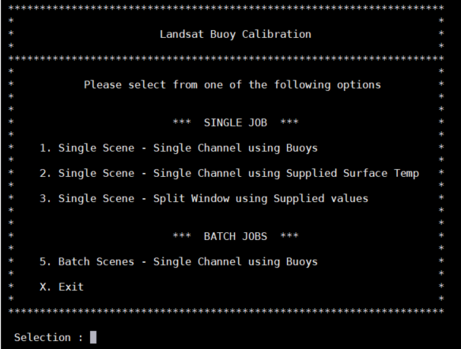<br>

## Terminal Processing
All navigation within the terminal program is done by entering the corresponding number (1, 2, 3 or 5) to perform the associated action, or <strong>X</strong> to exit the program.  Data input validation is performed for every entry made and is evaluated when you press the <strong>Enter</strong> key.  Please note that the data validation only checks for correct format of Scene ID/Product ID, not if the ID actually exists.

### Terminal Single Channel using Buoy Data
The original version of this module (no gui, just command line processing) was developed on Fedora x64 by Nathan Dileas (nid4986@g.rit.edu).  His original work is available at the links provided below.  

Repository: https://github.com/natedileas/Landsat-Buoy-Calibration.  
README: https://github.com/natedileas/Landsat-Buoy-Calibration/blob/master/README.md

The current version includes some corrections pertaining to bulk temperature, where additional parameters were including in the water mixing prerequisites to determine validity of raw data before performing calculations.  This mitigates instances where scenes were included or excluded with invalid bulk temperature condition restrictions.

#### Terminal Buoy Single Scene
To process a single scene, press 1 on the keyboard and press the <strong>Enter</strong> key.

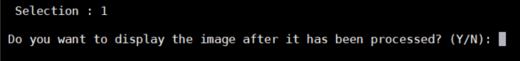<br>

You will now be asked if you want to display each image as it is processed.  If you do not make a choice, the system will indicate that you haven't and continue to ask for a choice until one is made.

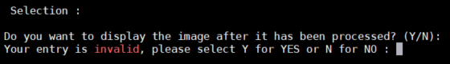<br>

Press y on the keyboard for yes and n, for no.  Press the <strong>Enter</strong> key after making your decision to proceed.

Now you may enter the Scene ID/Product ID to process.  It can be typed in, or copy and pasted.  I suggest copy and paste, since entering the IDs by hand is error-prone.  Press the <strong>Enter</strong> key after supplying the ID.

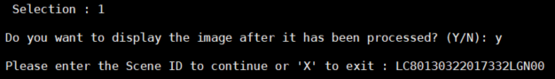<br>

At this point the processing will start.  If the landsat image already exists in the download directory, the system will process without downloading.  If however the image doesn't exist, it will search through the available sources for the file and start the download.

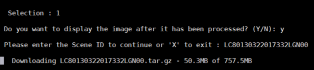<br>

Once the download has been completed, the system will extract the .tar.gz file and begin processing the buoys.

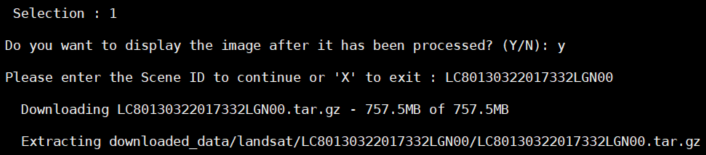<br>

<br>

After processing has been completed, the output of the processing will be displayed on screen

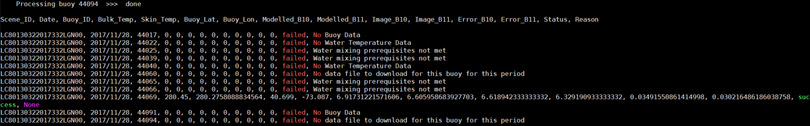<br>

The system will automatically delete all the files that were created for the download and the processing (other than the output files) if the option is set to auto delete (discussed in the [Notes](#notes) section).  You can press enter to return to the main menu

<br>

To get details about the output files, please refer to the [Output](#output) section at the bottom of this document.

#### Terminal Buoy Batch Processing
> To process a batch of scenes you first have to copy the batch file into the appropriate directory.  
>
> ```
> <your chosen path>/Landsat-Buoy-Calibration/input/batches
> ```
>
> The file can have any extension, however the extention <strong>.batch</strong> is suggested to keep it separate from other extensions that are used in the program.
>
> Batches are automatically detected from the <em>input/batches</em> directory when the filename is entered in the terminal interface.
>
> Batch files must be in the format of <strong>1 Scene ID/Product ID per line</strong> (the different formats of Scene IDs and Product IDs may be mixed in the same batch file), with <strong>NO</strong> punctuation (no spaces, no breaks, no commas, no titles, etc.).  The example included below is the <em>small.batch</em> file:
>
> ```
> LC80130322017332LGN00 
> LC08_L1TP_017030_20160614_20170220_01_T1
> LC80140372017307LGN00
> ```
>
> There are three examples included in the <em>Landsat-Buoy-Calibration/Examples/input/batches/</em> directory.  The examples include one working batch, one empty batch and one faulty batch.  Faulty Scene ID Product ID's will be detected when the <strong>Process</strong> button is pressed.
>
>> To upload your own batch, create the file using your favorite text editor (<a href="https://notepad-plus-plus.org/">Notepad++</a> in Windows and <a href="https://notepadqq.com">Notepadqq</a> in Linux are good options).  Connect to the server with a SFTP/SCP client, then copy and paste the > file in the <em>input/batches</em> directory.

To process a batch of scenes, press 5 on the keyboard and press the <strong>Enter</strong> key.

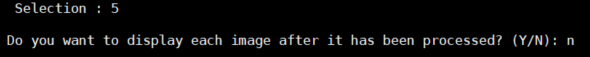<br>

You will now be asked if you want to display each image as it is processed.  If you do not make a choice, the system will indicate that you haven't and continue to ask for a choice until one is made.

<br>

Press y on the keyboard for yes and n, for no.

<p><strong><font color='red'>
!!!!!!!!!!!!!!!!!!!!!!!!!!!!!!!!!!!!!!!!!!!!!!!!!!!!!!!!!!!!!! PLEASE NOTE !!!!!!!!!!!!!!!!!!!!!!!!!!!!!!!!!!!!!!!!!!!!!!!!!!!!!!!!!!!!!!<br>

&nbsp;&nbsp;&nbsp;If you choose yes at this point, the process will halt after each image until the image is closed,<br>
&nbsp;at which point the system will continue to the next image. This was implemented so the network <br>
&nbsp;&nbsp;&nbsp;&nbsp;link, the terminal emulator and the screen don't get saturated with large batches (if you run a <br>
&nbsp;&nbsp;batch with 100 scenes, your computer, the server and the network would have to maintain 101 <br>
&nbsp;&nbsp;&nbsp;&nbsp;&nbsp;&nbsp;&nbsp;&nbsp;&nbsp;&nbsp;&nbsp;&nbsp;&nbsp;&nbsp;&nbsp;&nbsp;&nbsp;&nbsp;concurrent sessions, one for each image and one for the program).<br>

!!!!!!!!!!!!!!!!!!!!!!!!!!!!!!!!!!!!!!!!!!!!!!!!!!!!!!!!!!!!!!!!!!!!!!!!!!!!!!!!!!!!!!!!!!!!!!!!!!!!!!!!!!!!!!!!!!!!!!!!!!!!!!!!!!!!!!!!!!!!!!!!!!
</font></strong></p>

Press the <strong>Enter</strong> key after making your decision to proceed.

Now you may enter the name of the batch file to process.  You only enter the filename and extension of the file you uploaded into the <em>/input/batches</em> directory. Press the <strong>Enter</strong> key after supplying the ID.

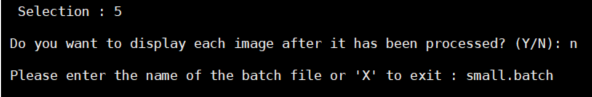<br>

At this point the processing will start.  The batch processing section of the code differs from the single process in the sense that the process downloads the first ID, processes it, displays the output to screen (and writes it to file) and continues to the next ID.

If the landsat image already exists in the download directory, the system will process without downloading.  If however the image doesn't exist, it will search through the available sources for the file and start the download.

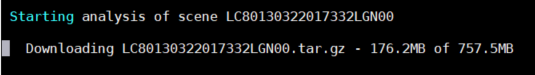<br>

Once the download has been completed, the system will extract the .tar.gz file and begin processing the buoys.

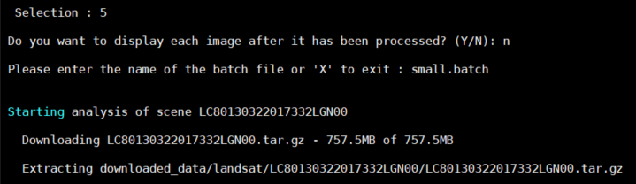<br>

<br>

After processing has been completed, the output of the processing will be displayed on screen.

<br>

The system will automatically delete all the files that were created for the download and the processing (other than the output files) if the option is set to auto delete (discussed in the [Notes](#notes) section).  The system will then automatically start downloading and processing the next scene in the batch file.

Once all the IDs in the batch file have been processed, <strong>Press <strong>Enter</strong> to continue...</strong> will be displayed at the bottom of the screen.  At this point you can press enter to return the main menu.

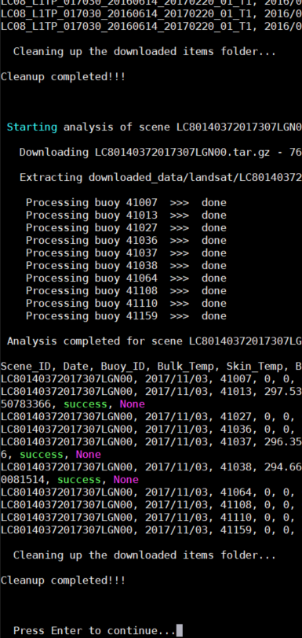<br>

To get details about the output files, please refer to the [Output](#output) section at the bottom of this document.

### Terminal Single Channel Top of Atmosphere
To perform a Single Channel operation with your own supplied surface temperature, choose option two.  Press 2 on the keyboard and then press Enter.

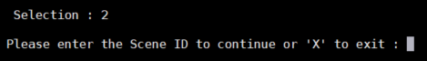<br>

Now you may enter the Scene ID/Product ID which you want to use to extract and calcualte the Top of Atmosphere radiance which will be used for the process.  It can be typed in, or copy and pasted.  I suggest copy and paste, since entering the IDs by hand is error-prone.  Press the <strong>Enter</strong> key after supplying the ID.

<br>

Next you will be asked to supply the surface temperature you wish to use for the calculations.

<strong>The value has to fall within the valid range of 200 to 350 kelvin.</strong>

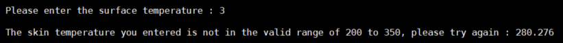<br>

Following the surface temperature, you need to provide the latitude and longtitude of the supplied surface temperature reading.

<strong>The latitude has to fall within the valid range of -90 to +90.</strong>

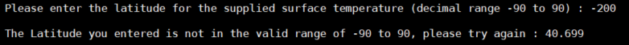<br>

<strong>The longtitude has to fall within the valid range of -180 to +180.</strong>

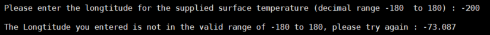<br>

Next you need to supply the emissivities to be used for bands 10 and 11.  There are no normal ranges for these values but default values have been supplied.  You can press enter (without any input) to use the default values or enter your own preferred values.  There are no valid range restrictions for these values, therefore any value entered will be accepted.

<br>

Once all the data has been supplied, the system will start processing.  If the image already exists in the downloads directory, the system will process immediate.  If however the image does not exist, the system will search for the appropriate scene at all the sources, download the scene and then process.

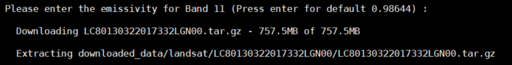<br>

Once the processing has been completed, the output will be displayed and the downloaded data cleaned.  At this point you can press enter to return to the main menu.

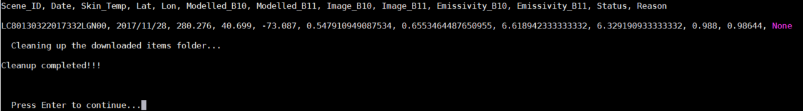<br>

### Terminal Split Window Land Surface Temperature
To perform a Split Window operation choose option three.  Press 3 on the keyboard and then press Enter.

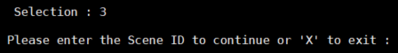<br>

Now you may enter the Scene ID/Product ID which you want to use to extract and calcualte the Top of Atmosphere radiance which will be used for the process.  It can be typed in, or copy and pasted.  I suggest copy and paste, since entering the IDs by hand is error-prone.  Press the <strong>Enter</strong> key after supplying the ID.

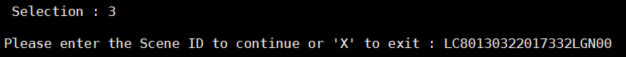<br>

Following the Scene ID/Product ID, you need to provide the latitude and longtitude to be used for the proces.

<strong>The latitude has to fall within the valid range of -90 to +90.</strong>

<br>

<strong>The longtitude has to fall within the valid range of -180 to +180.</strong>

<br>

Next you need to supply the emissivities to be used for bands 10 and 11.  There are no normal ranges for these values but default values have been supplied.  You can press enter (without any input) to use the default values or enter your own preferred values.  There are no valid range restrictions for these values, therefore any value entered will be accepted.

<br>

The final set of data required is related to Gain and Bias.  If you do not wish you add gain and bias, you simply press <strong>N</strong> and enter and the program will start the processing phase which includes downloading and extracting the file (if required) as well as performing the required processing.

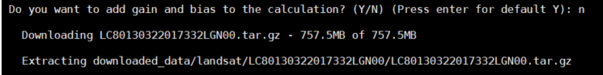<br>

If you wish to add Gain and Bias to the process, simply press enter at the question to use the default value (yes) after which you'll have an oportunity to enter gain and bias values.  Default values have already been supplied (which will be applied if you press enter at each entry without entering any value), alternatively you can supply your own values for processing.

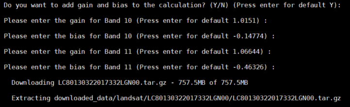<br>

Once all the data has been supplied, the system will start processing.  If the image already exists in the downloads directory, the system will process immediate.  If however the image does not exist, the system will search for the appropriate scene at all the sources, download the scene and then process.

After the processing has been completed, the output will be displayed and the downloaded data cleaned.  At this point you can press enter to return to the main menu.

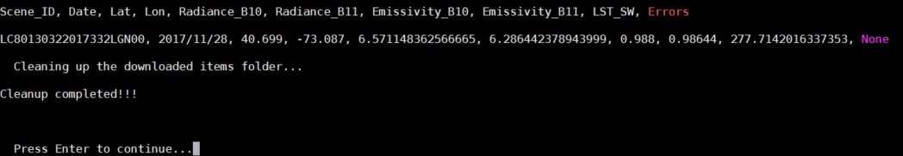<br>

# Output
During program launch it creates a directory structure using a algorithm based hierarchy. All output that is displayed in the GUI during operation, also creates an output file in the output directory in the appropriate directory structure location.

Below is an example of the output that was created during the creation of this manual

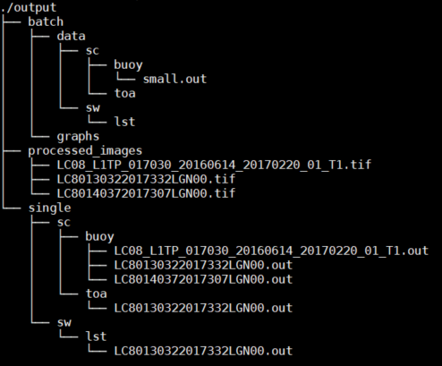<br>

When running any process that requires a Scene ID/Product ID, the output will be a file with the same name sa the ID supplied, in the associated directory.  If you run a batch, the output file will be in the batch directory structure with the name of the input batch file.

<p><strong><font color='red'>
!!!!!!!!!!!!!!!!!!!!!!!!!!!!!!!!!!!!!!!!!!!!!!!!!!!!!!!!!!!!!! PLEASE NOTE !!!!!!!!!!!!!!!!!!!!!!!!!!!!!!!!!!!!!!!!!!!!!!!!!!!!!!!!!!!!!!

&nbsp;&nbsp;&nbsp;&nbsp;&nbsp;&nbsp;&nbsp;&nbsp;&nbsp;&nbsp;&nbsp;If you run a batch or single process for the same id, the original will be overwritten! <br>

!!!!!!!!!!!!!!!!!!!!!!!!!!!!!!!!!!!!!!!!!!!!!!!!!!!!!!!!!!!!!!!!!!!!!!!!!!!!!!!!!!!!!!!!!!!!!!!!!!!!!!!!!!!!!!!!!!!!!!!!!!!!!!!!!!!!!!!!!!!!!!!!!!
</font></strong></p>

# Notes

The settings file located at ```<your chosen path>/Landsat-Buoy-Calibration/buoycalib/settings.py``` contains multiple settings and configuration options.
<strong><font color='red'>!!! No values in this file should be changed unless you know exactly what you're doing !!!</font></strong>

Some of the values more prone to changes are:

<ol>
    <li>Disk Space Maintenance<ul style="list-style-type:none;">
        <li>This setting deletes all files that are downloaded or created during processing.  If you set this value to <em>False</em>, no data will be deleted.  Please note that this can use a large amount of disk space in a short period of time.</li>
        <li><code>CLEAN_FOLDER_ON_COMPLETION = <em>True</em></code><br></li>
        <br>
    </ul></li>
    <li>SQL Server Support<ul style="list-style-type:none;">
        <li>These properties are associated with a previous version of the program where output was written to an SQL database.  After the refactoring of the code, the SQL service has not yet been implemented, therefore these values should not be changed until the functionality is added back in a future revision of the program.</li>
        <li><code>USE_MYSQL = <em>False</em></code><br></li>
        <li><code>SQL_CONFIGURED = <em>False</em></code><br></li>
        <br>
    </ul></li>
    <li>Default Emmissivity Values<ul style="list-style-type:none;">
        <li>These are the default emmissivity values that are displayed in the interfaces and used during processing.  They can be changed in the interface while processing, or if you want to permanently change them it can be done here.</li>
        <li><code>DEFAULT_EMIS_B10 = <em>0.988</em></code><br></li>
        <li><code>DEFAULT_EMIS_B11 = <em>0.98644</em></code><br></li>
        <br>
    </ul></li>
    <li>Default Gain and Bias Values for Band 10 and 11 used for Split Window Calculations<ul style="list-style-type:none;">
        <li>These are the default gain and bias values used for bands 10 and 11 that are displayed in the interfaces and used during processing.  They can be changed in the interface while processing, or if you want to permanently change them it can be done here.</li>
        <li><code>DEFAULT_GAIN_B10 = <em>1.0151</em></code><br></li>
        <li><code>DEFAULT_GAIN_B11 = <em>1.06644</em></code><br></li>
        <li><code>DEFAULT_BIAS_B10 = <em>-0.14774</em></code><br></li>
        <li><code>DEFAULT_BIAS_B11 = <em>-0.46326</em></code><br></li>
        <br>
    </ul></li>
</ol>

<strong>There are many other settings in this file, including the web addresses where source files are downloaded from, but no other setting should require modification.</strong>